# 🌍 AcunMedya Travel Project

ASP.NET Core MVC ile geliştirilmiş olan **AcunMedya Travel**, bir turizm ajansı için hazırlanmış tam donanımlı bir web projesidir. Ziyaretçiler, turlar ve destinasyonlar hakkında bilgi alabilirken, admin panelinden içerikler dinamik olarak yönetilebilmektedir.

Bu proje, .NET ekosistemindeki önemli yapıların bir arada nasıl kullanılacağını ve katmanlı mimarinin nasıl kurulacağını açıkça göstermektedir.

---

## 🎯 Proje Hedefi

Turizm sektörü için dinamik, yönetilebilir ve kullanıcı dostu bir rezervasyon platformu oluşturmak. Bu platform hem son kullanıcıya hitap ederken hem de yöneticilere kolay bir kontrol paneli sunar.

---

### 👤 Ziyaretçi Paneli

- Anasayfa üzerinden:
  - Rehberler, destinasyonlar, paketler, bloglar
  - Dinamik slider alanı
- Rezervasyon formu ile kayıt oluşturma
- Footer’da sosyal medya, iletişim bilgileri ve özet menüler
- Responsive tasarım (mobil uyumlu)

---
 ## 📸 Ekran Görüntüleri
 
### 🔹 Anasayfa

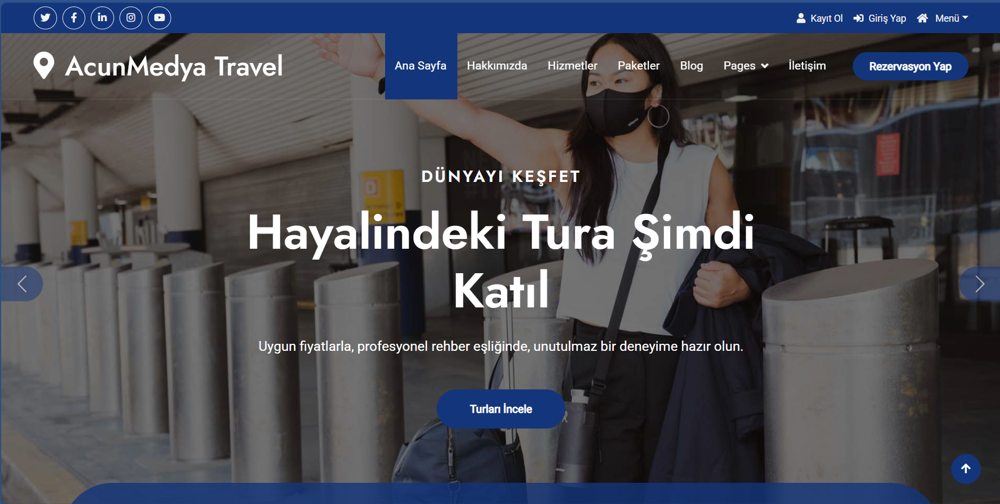
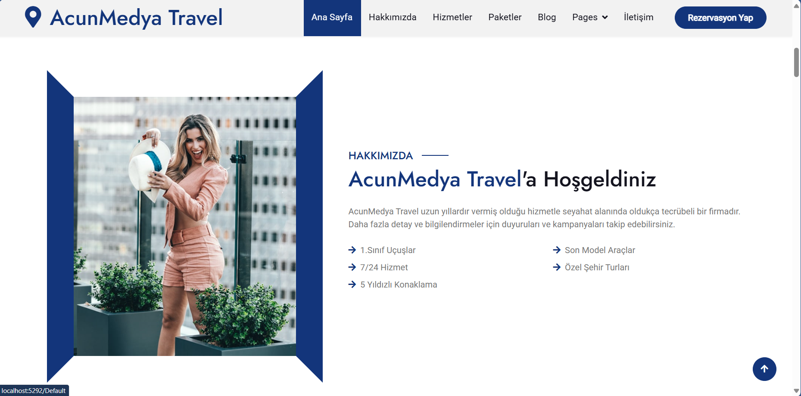
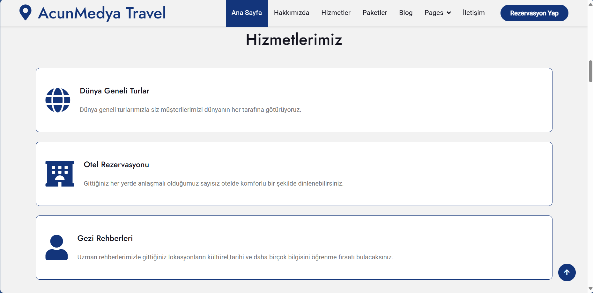
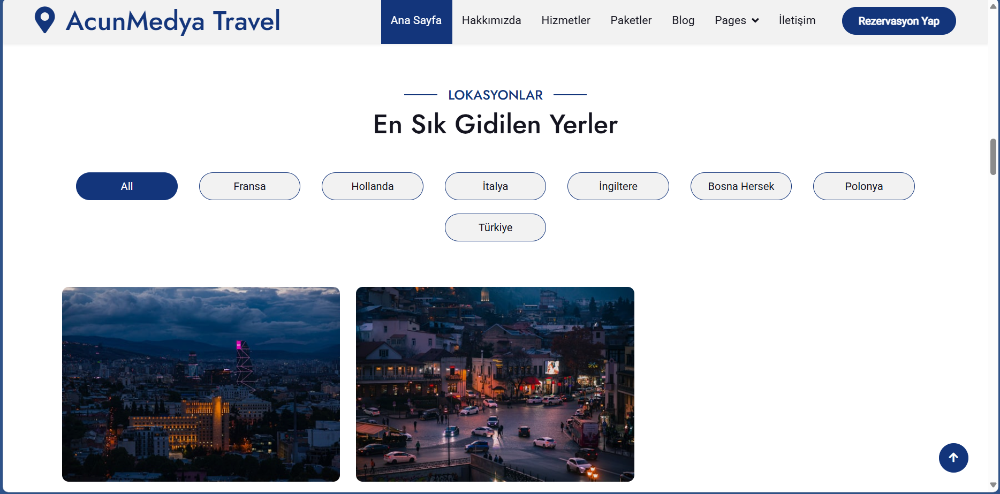
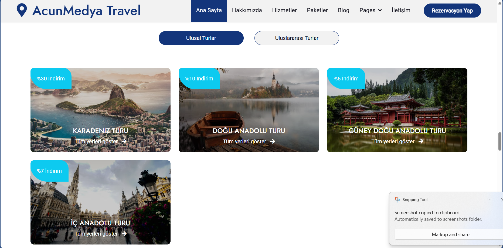
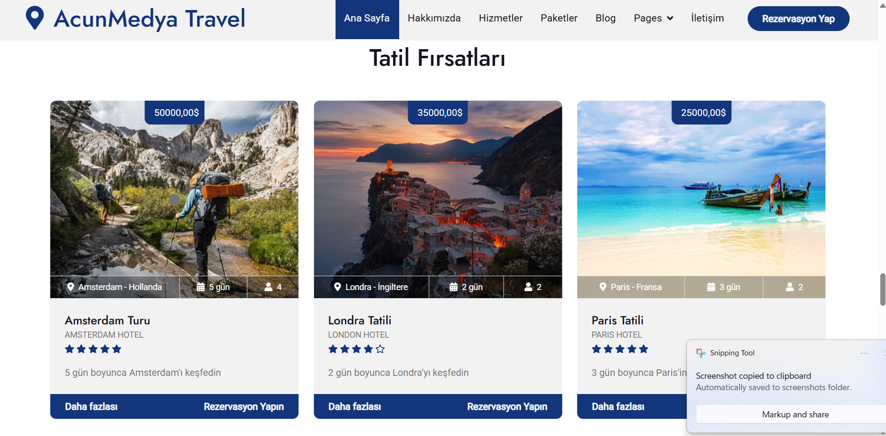

---

### 🔹 Rehberler

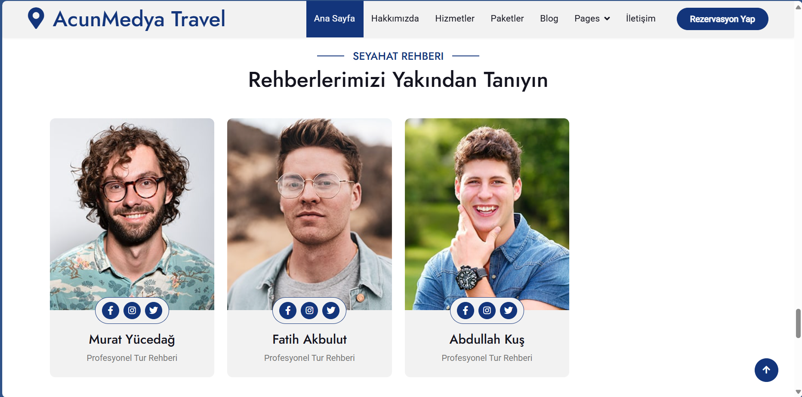

---

### 🔹 Rezervasyon Formu

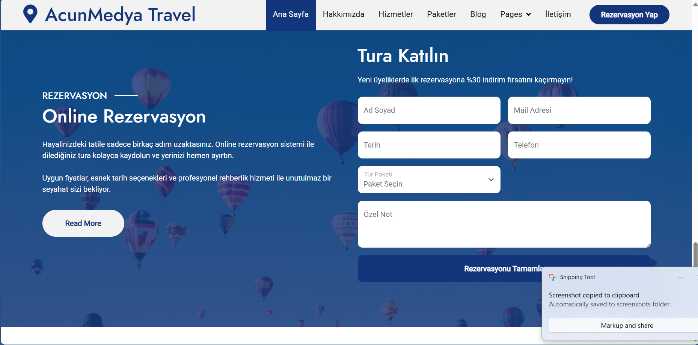

---

### 🔹 Footer ve İletişim

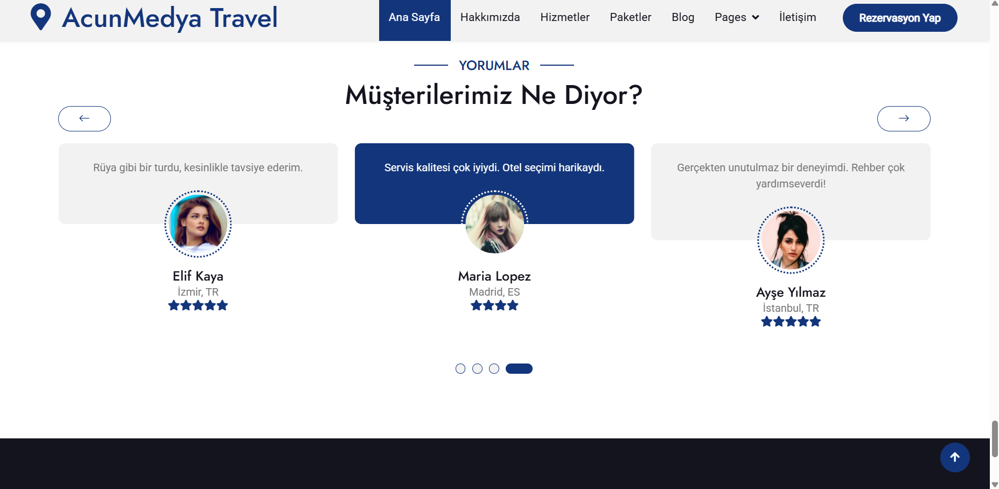
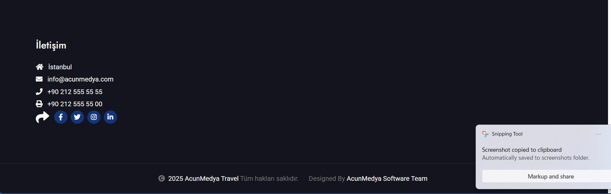

---
### 🛠️ Admin Panel

- `Area` yapısı ile izole edilmiş admin bölgesi
- CRUD işlemleri:
  - Ülkeler 🇹🇷
  - Şehirler 🏙️
  - Rehberler 👨‍💼
  - Paketler 🎒
  - Turlar 🌍
  - Yorumlar 💬
  - Rezervasyonlar 📝
  - Hakkımızda & Footer 🧾
- Dashboard özelliği:
  - Toplam sayılar (ülke, şehir, rezervasyon vb.)
  - Son 5 rezervasyonun listesi
- ViewComponent destekli modüler yapı
- Katmanlı mimari

---
## 🛠️ Admin Paneli
## 📸 Ekran Görüntüleri
### 🔹 Dashboard Sayfası

> Genel istatistik kartları ve son 5 rezervasyon görünümü.

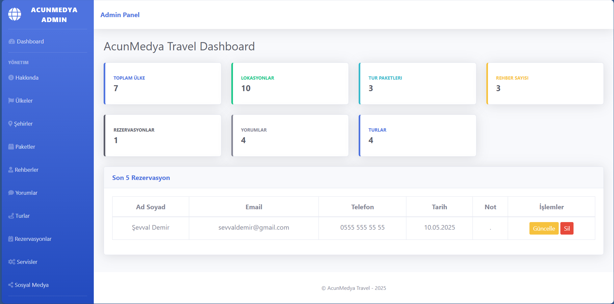

---
### 🔹 Hakkında (About)

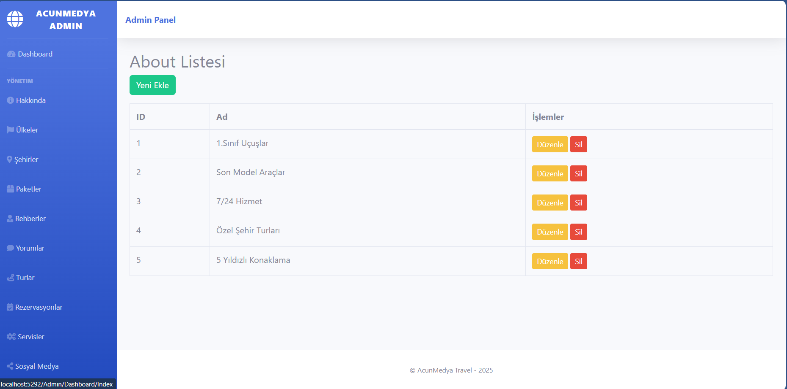

---

### 🔹 Ülke Yönetimi

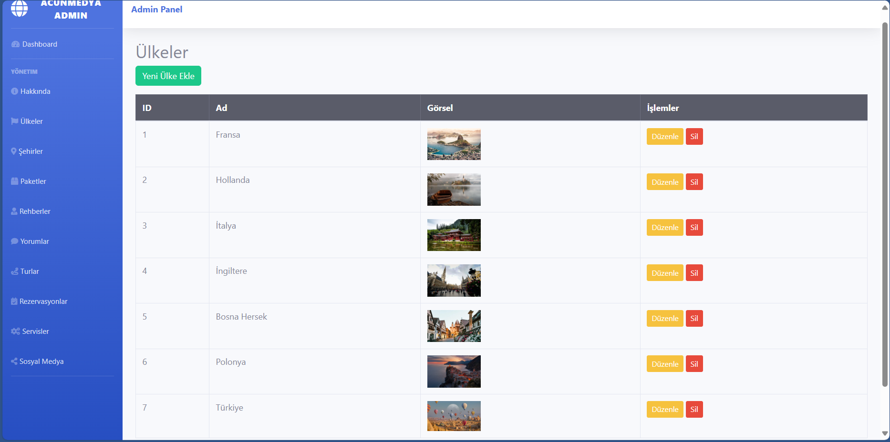

---

### 🔹 Şehir Yönetimi

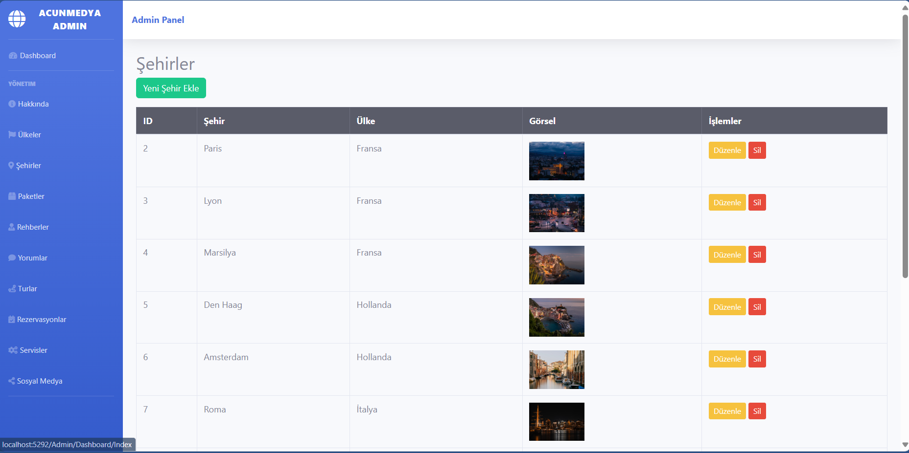

---

### 🔹 Paket Yönetimi

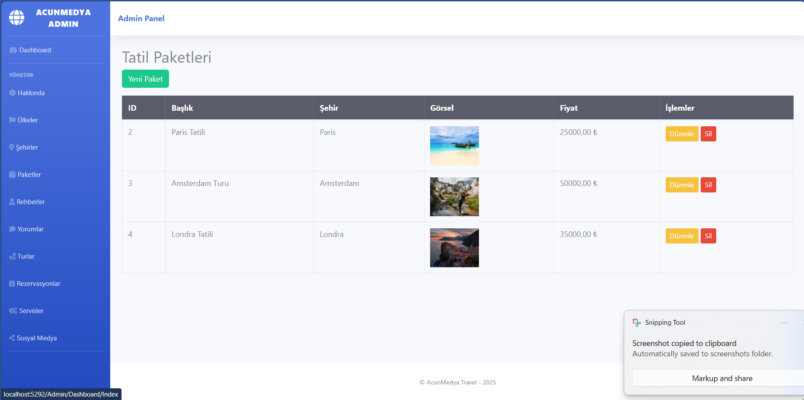

---

### 🔹 Turlar

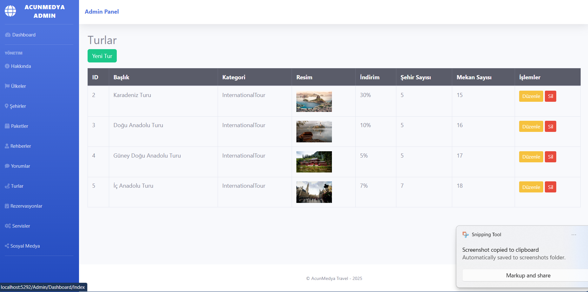

### 🔹 Yorumlar (Testimonials)

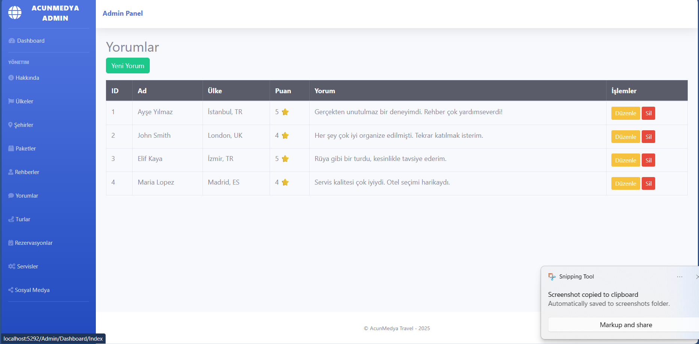

---
## 🛠 Kullanılan Teknolojiler

| Teknoloji             | Açıklama                                 |
|----------------------|------------------------------------------|
| ASP.NET Core MVC     | Web uygulama çatısı                      |
| Entity Framework Core| ORM ve Code First veri erişimi          |
| MS SQL Server        | Veritabanı yönetim sistemi               |
| Bootstrap 5          | Responsive UI                            |
| jQuery, Owl Carousel | Dinamik arayüz bileşenleri               |
| Razor View Engine    | .cshtml templating                       |
| ViewComponent        | Component tabanlı bölümler               |
| Areas                | Admin paneli için ayrı yapı              |

---
